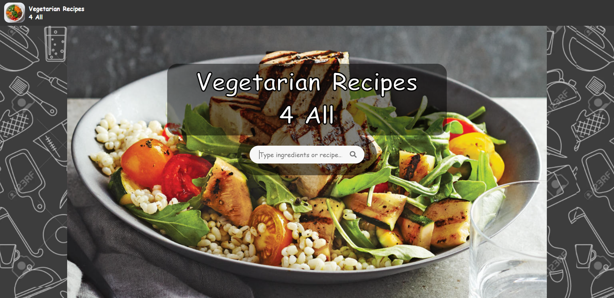

# vegetarian-recipes

React Project App made using https://spoonacular.com/food-api/docs APIs, where you can get vegetarian recipes by typing one or more ingredients' name in the search bar.

Features: dedicated page for single recipes, responsive design.

Link to project deployed on Netlify: https://vegetarianrecipes4all.netlify.app/
